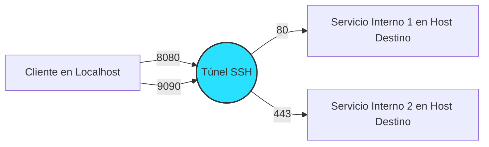

# ssh_tunnel

## Descripción General
Este proyecto permite establecer túneles SSH seguros utilizando Docker. Es ideal para enrutar tráfico a través de un servidor SSH para alcanzar destinos que de otra manera no serían accesibles directamente.

## Configuración
Antes de iniciar el contenedor, es necesario configurar las variables de entorno y los puertos que se mapearán.
La configuración del proyecto se realiza a través del archivo `.env`, que contiene todas las variables necesarias para la configuración del túnel SSH y la autenticación.

### Variables de Entorno
- `SSH_USER`: Usuario para la autenticación SSH.
- `SSH_HOST`: Host del servidor SSH.
- `SSH_PORT`: Puerto del servidor SSH.
- `USE_SSH_KEY`: Establecer como `true` para usar autenticación por clave, `false` para usar contraseña.
- `SSH_PASS`: Contraseña SSH (requerida solo si `USE_SSH_KEY` es `false`).
- `TUNNEL_CONFIG`: Configuración del túnel en formato "puerto_local:host_destino:puerto_destino".
- `SSH_KEY_DIR`: Directorio de claves SSH (requerido si `USE_SSH_KEY` es `true`).

### Ejemplos de Configuración
1. **Túnel Simple**

   SSH_USER=user

   SSH_HOST=example.com

   SSH_PORT=22

   USE_SSH_KEY=true

   TUNNEL_CONFIG="8080:internal-service:80"

   SSH_KEY_DIR=./ssh-keys
   #### Diagrama de Funcionamiento

2. **Túnel Simple con autenticación mediante usuario y contraseña**

   SSH_USER=tu_usuario_ssh

   SSH_HOST=host_ssh

   SSH_PORT=puerto_ssh

   USE_SSH_KEY=false # Usar autenticación por contraseña

   SSH_PASS=tu_contraseña

   TUNNEL_CONFIG="8080:host_destino:80"
   #### Diagrama de Funcionamiento

3. **Múltiples Túneles**

   SSH_USER=user

   SSH_HOST=example.com

   SSH_PORT=22

   USE_SSH_KEY=false

   SSH_PASS=password123

   TUNNEL_CONFIG="8080:internal-service1:80,9090:internal-service2:443"

   SSH_KEY_DIR=./ssh-keys
   #### Diagrama de Funcionamiento

## Uso

### Controlar el Túnel SSH
Utilice el script `control_tunnel.sh` para controlar el túnel SSH:
- Para iniciar: `./control_tunnel.sh start`
- Para detener: `./control_tunnel.sh stop`

### Construir el Contenedor
Para construir el contenedor Docker, ejecute:
`docker-compose build`

